# 🖥️ Windows Active Directory Lab — AWS EC2

A hands-on Systems Administration lab deploying a Windows Server 2022 Domain Controller on AWS EC2 with Active Directory, DNS, and DHCP — and attempting to join an Ubuntu Linux client to the Windows domain.

---

## 🏗️ Architecture

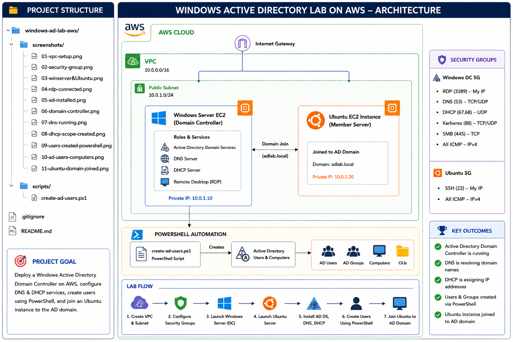

---

## 🛠️ Tech Stack

| Component | Technology |
|---|---|
| Domain Controller | Windows Server 2022 (EC2) |
| Linux Client | Ubuntu 24.04 LTS (EC2) |
| Directory Service | Active Directory Domain Services |
| DNS | Windows DNS Server |
| DHCP | Windows DHCP Server |
| Automation | PowerShell |
| Cloud | AWS EC2, VPC, Security Groups |
| Domain | lab.local |

---

## ✨ What This Lab Covers

- Deploying Windows Server 2022 on AWS EC2
- Installing and configuring Active Directory Domain Services
- Setting up DNS and DHCP on a Windows Server
- Bulk user creation and OU management via PowerShell
- Launching an Ubuntu Linux client in the same VPC
- Domain discovery from Ubuntu using `realmd`
- Troubleshooting Kerberos/GSS-SPNEGO authentication in AWS VPC environments
- AWS VPC and Security Group configuration

---

## 🔒 Security Group Rules

| Rule | Port | Source | Purpose |
|---|---|---|---|
| RDP | 3389 | My IP | Connect to Windows Server |
| SSH | 22 | My IP | Connect to Ubuntu client |
| All traffic | All | Security Group itself | Internal VM communication |

---

## 🚀 Deployment Steps

### Prerequisites
- AWS Account
- EC2 Key Pair (`.pem`)
- RDP client (`mstsc` — built into Windows)
- Basic Linux & Windows knowledge

---

### 1️⃣ VPC & Network Setup

- Create VPC: `ad-lab-vpc` with CIDR `10.0.0.0/16`
- Create 1 public subnet
- Create Security Group `ad-lab-sg` with rules above

---

### 2️⃣ Launch Windows Server EC2

- AMI: **Windows Server 2022 Base**
- Instance type: `t3.medium`
- Storage: 40GB
- Key pair: `ad-lab-key.pem`
- Security group: `ad-lab-sg`
- Assign Elastic IP for public access

Connect via RDP (Windows built-in):
```
Press Windows + R → type mstsc → Enter
Username: Administrator
Password: Decrypt using .pem file from EC2 console → Connect → RDP Client → Get Password
```

---

### 3️⃣ Install Active Directory

Inside the RDP session:
- Open **Server Manager → Add Roles and Features**
- Install **Active Directory Domain Services**
- Click the yellow flag → **Promote this server to a domain controller**
- Select **Add a new forest** → Root domain: `lab.local`
- Complete the wizard → server restarts automatically

---

### 4️⃣ Verify DNS

- Server Manager → Tools → **DNS**
- Confirm `lab.local` forward lookup zone is present

---

### 5️⃣ Configure DHCP

- Server Manager → Add Roles → Install **DHCP Server**
- Complete DHCP Configuration via the yellow flag
- Tools → DHCP → IPv4 → New Scope:
  - Range: `10.0.0.100` – `10.0.0.200`
  - DNS Server: Windows Server private IP
- Activate the scope

---

### 6️⃣ Bulk User Creation via PowerShell

Run `scripts/create-ad-users.ps1` in PowerShell ISE as Administrator:

```powershell
# Create OU
New-ADOrganizationalUnit -Name "LabUsers" -Path "DC=lab,DC=local"

# Create 10 users
$users = @("alice","bob","charlie","diana","edward","fiona","george","hannah","ivan","julia")

foreach ($user in $users) {
    New-ADUser `
        -Name $user `
        -GivenName $user `
        -SamAccountName $user `
        -UserPrincipalName "$user@lab.local" `
        -Path "OU=LabUsers,DC=lab,DC=local" `
        -AccountPassword (ConvertTo-SecureString "Welcome@123" -AsPlainText -Force) `
        -Enabled $true
    Write-Host "Created user: $user"
}
```

Verify in **Active Directory Users and Computers → LabUsers OU**

---

### 7️⃣ Launch Ubuntu EC2

- AMI: **Ubuntu Server 24.04 LTS**
- Instance type: `t2.micro`
- Same VPC, **same subnet** as Windows Server (important!)
- Same security group: `ad-lab-sg`
- Assign Elastic IP for SSH access

Connect via SSH:
```bash
chmod 400 ad-lab-key.pem
ssh -i ad-lab-key.pem ubuntu@<Ubuntu-Elastic-IP>
```

---

### 8️⃣ Ubuntu Domain Discovery

```bash
# Update packages
sudo apt update && sudo apt upgrade -y

# Install required packages
sudo apt install -y realmd sssd sssd-tools adcli packagekit

# Point DNS to Windows Server
sudo nano /etc/resolv.conf
# Change nameserver to Windows Server private IP: 10.0.0.159

# Discover the domain
realm discover lab.local
```

Domain was successfully discovered:
```
lab.local
  type: kerberos
  realm-name: LAB.LOCAL
  domain-name: lab.local
  configured: no
  server-software: active-directory
  client-software: sssd
```

---

### ⚠️ Known Issue — Domain Join Blocked by Kerberos/GSS-SPNEGO

During the domain join step, the following error was encountered:

```
realm: Couldn't join realm: Insufficient permissions to join the domain
adcli: couldn't connect to lab.local domain: Couldn't authenticate to 
active directory: SASL(-1): generic failure: GSSAPI Error: Unspecified 
GSS failure. Minor code may provide more information 
(Server not found in Kerberos database)
```

**Root cause analysis:**
- Ubuntu successfully discovered `lab.local` and authenticated as `Administrator@LAB.LOCAL`
- Kerberos GSS-SPNEGO negotiation failed at the SASL bind stage
- The error "Server not found in Kerberos database" indicates the Ubuntu hostname `IP-10-0-9-110` was not registered as a valid SPN (Service Principal Name) in Active Directory
- In AWS VPC environments, EC2 hostnames are auto-generated IP-based names (e.g. `IP-10-0-9-110`) which Kerberos does not automatically register as valid SPNs
- Time sync between both instances was verified (less than 1 minute difference) and ruled out as the cause

**Troubleshooting steps attempted:**
- Verified ping connectivity between both instances ✅
- Pointed Ubuntu DNS to Windows Server (`/etc/resolv.conf`) ✅
- Verified Administrator account enabled and not locked out ✅
- Added Administrator to Domain Admins group ✅
- Manually registered SPN via `setspn` on Windows Server
- Forced NTP time sync on Ubuntu

**Fix (for future attempt):**
- Set a proper hostname on Ubuntu before joining: `sudo hostnamectl set-hostname ubuntu-client.lab.local`
- Register the hostname in Windows DNS manually before attempting join
- Or use AWS Managed Microsoft AD which handles SPN registration automatically

---

## 📸 Screenshots

### ☁️ Infrastructure

#### VPC Setup
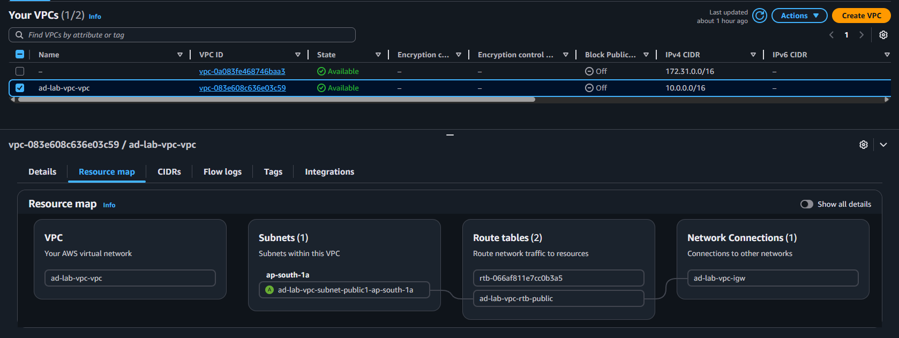

#### Security Group Rules
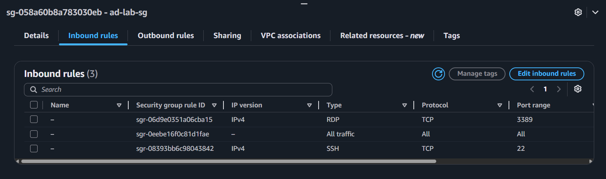

#### EC2 Instances Running
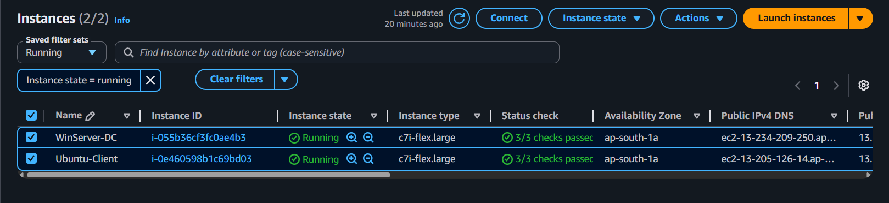

---

### 🖥️ Windows Server

#### RDP Connected
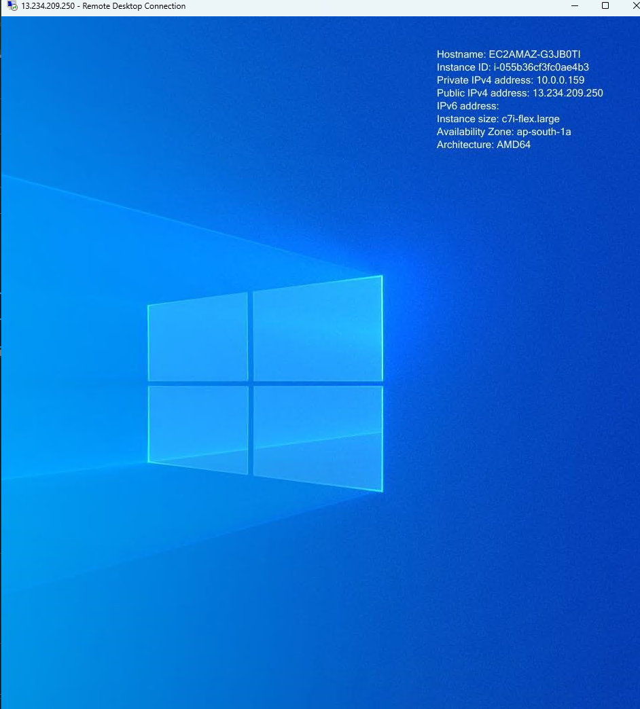

#### AD DS Installed
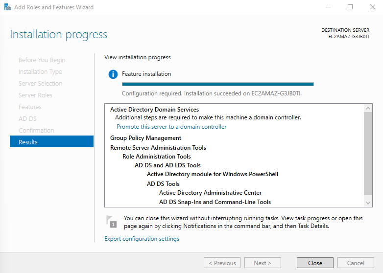

#### Domain Controller Promoted
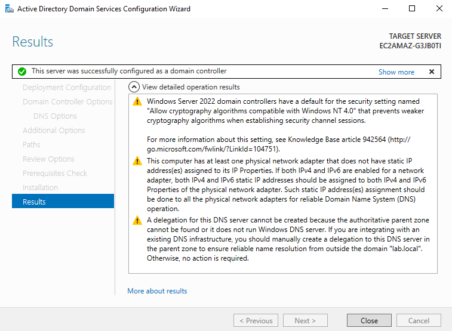

#### DNS Running
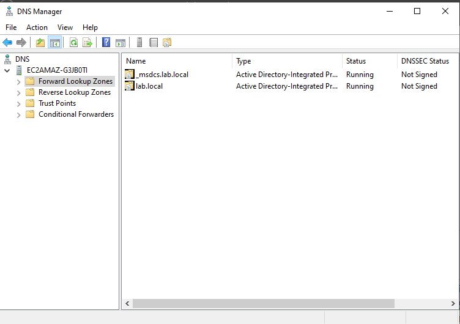

#### DHCP Scope Active
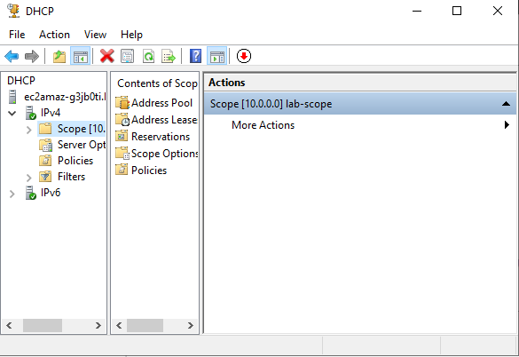

---

### 👥 Active Directory

#### PowerShell User Creation
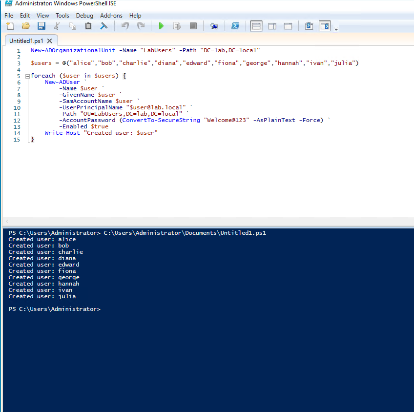

#### Users in AD Users & Computers
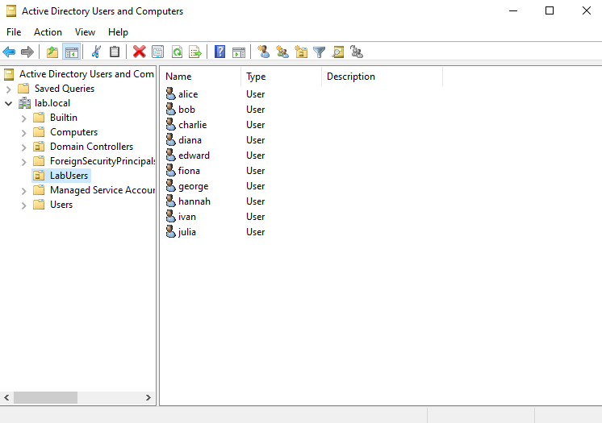

---

### 🐧 Ubuntu Client

#### Domain Discovery Successful
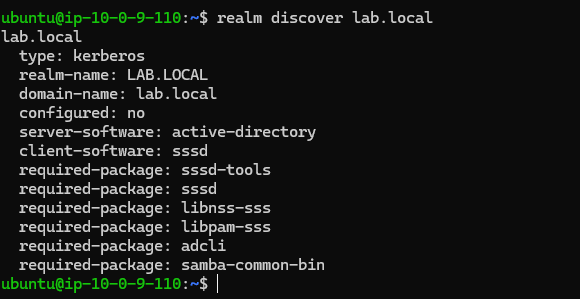

---

## 📂 Project Structure

```
windows-ad-lab-aws/
├── scripts/
│   └── create-ad-users.ps1
├── screenshots/
│   ├── 01-vpc-setup.png
│   ├── 02-security-group.png
│   ├── 03-winserver&Ubuntu-ec2-running.png
│   ├── 04-rdp-connected.png
│   ├── 05-ad-installed.png
│   ├── 06-domain-controller-promoted.png
│   ├── 07-dns-running.png
│   ├── 08-dhcp-scope-created.png
│   ├── 09-users-created-powershell.png
│   ├── 10-ad-users-computers.png
│   ├── 11-ubuntu-domain-joined.png
├── README.md
└── .gitignore
```

---

## ⚠️ Cleanup

To avoid AWS charges after completing the lab:

```
EC2 Console → Select both instances → Instance State → Terminate
EC2 Console → Elastic IPs → Release both
VPC Console → Delete ad-lab-vpc
EC2 Console → Security Groups → Delete ad-lab-sg
```

---

## 🔮 Future Improvements

- Fix domain join by setting proper hostname before joining
- Add Group Policy Objects (GPOs) for password and desktop policies
- Configure Roaming Profiles
- Add a second Domain Controller for high availability
- Automate full setup using Terraform
- Add monitoring with CloudWatch agent on both instances

---

## 👤 Author

### Srikanth Sanjay Pawar

- LinkedIn: https://linkedin.com/in/srikanth-sanjay-pawar
- GitHub: https://github.com/Heyysri
- Email: sreekanthsanjay5@gmail.com
